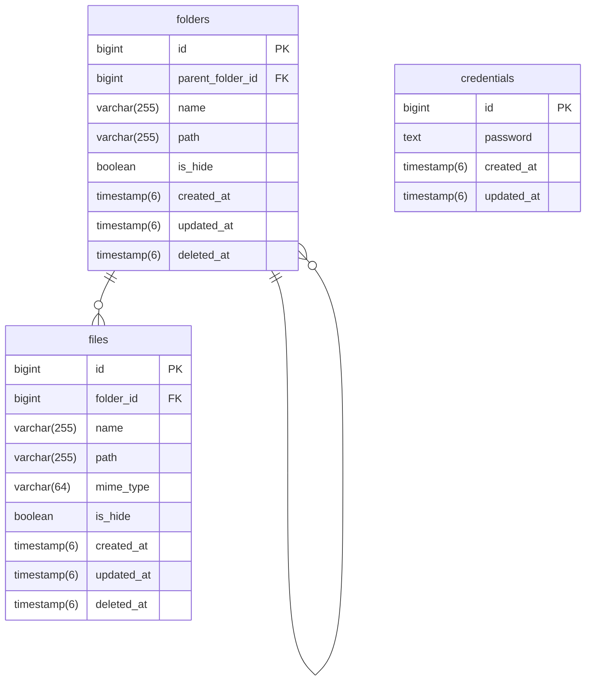

# ER図

 

# テーブル構成

## folders

**フォルダテーブル**

| タイプ | 名称 | キー | Null許容 | 説明 |
| ---- | ---- | ---- | ---- | ---- |
| bigint | id | PK | | ID |
| bigint | parent_folder_id | FK | TRUE | フォルダID |
| varchar(255) | name | | | フォルダ名 |
| varchar(255) | path | UNIQUE | | フォルダパス |
| boolean | is_hide | | | 非表示フラグ |
| timestamp(6) | created_at | | | 作成日 |
| timestamp(6) | updated_at | | | 更新日 |
| timestamp(6) | deleted_at | | TRUE | 削除日 |

## files

**ファイルテーブル**

| タイプ | 名称 | キー | Null許容 | 説明 |
| ---- | ---- | ---- | ---- | ---- |
| bigint | id | PK | | ID |
| bigint | folder_id | FK | | フォルダID |
| varchar(255) | name | | | ファイル名 |
| varchar(255) | path | UNIQUE | | ファイルパス |
| varchar(64) | mime_type | | | MIMEタイプ |
| boolean | is_hide | | | 非表示フラグ |
| timestamp(6) | created_at | | | 作成日 |
| timestamp(6) | updated_at | | | 更新日 |
| timestamp(6) | deleted_at | | TRUE | 削除日 |

## credentials

**認証情報テーブル**

| タイプ | 名称 | キー | Null許容 | 説明 |
| ---- | ---- | ---- | ---- | ---- |
| bigint | id | PK | | ID |
| text | password | UNIQUE | | パスワード |
| timestamp(6) | created_at | | | 作成日 |
| timestamp(6) | updated_at | | | 更新日 |
